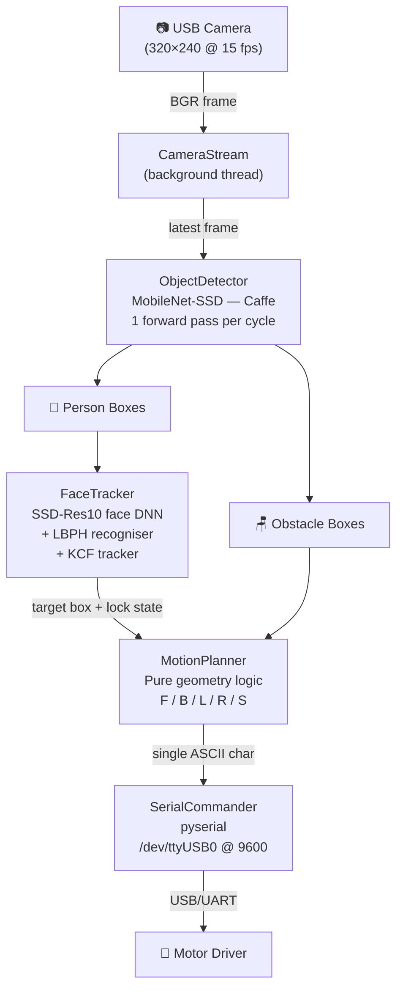
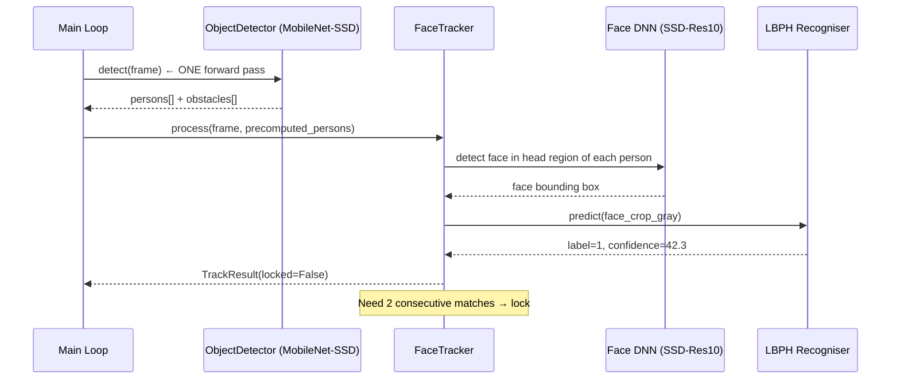
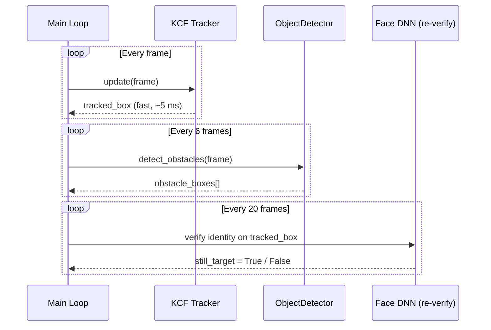
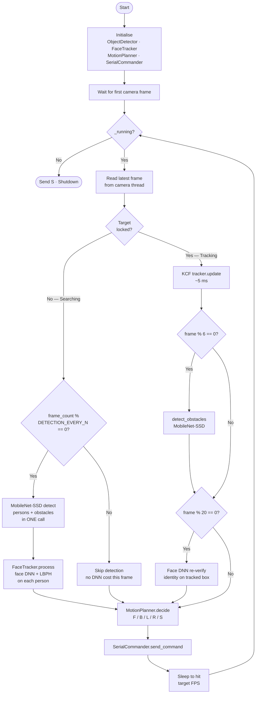
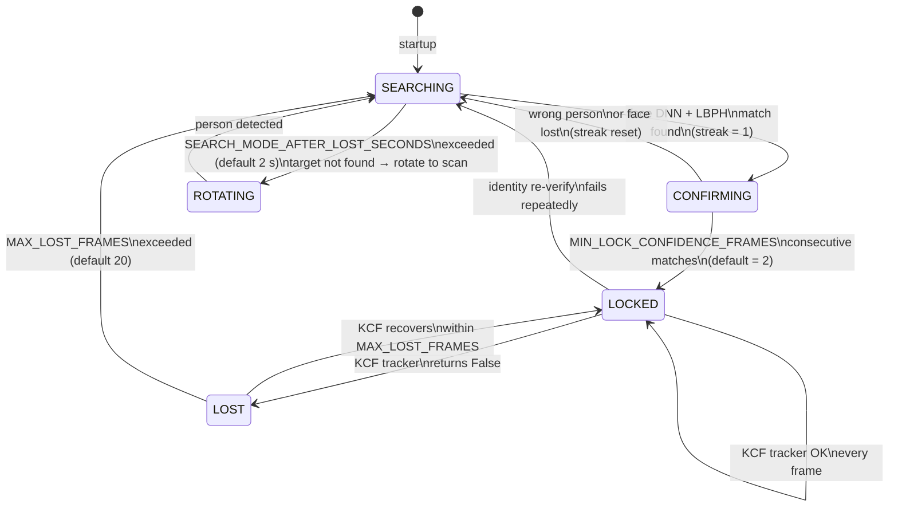
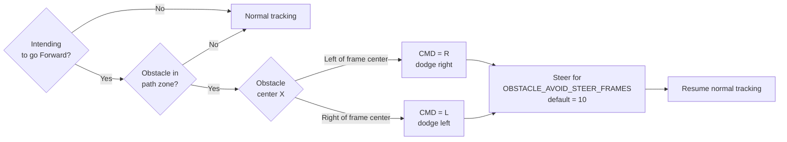

# 🤖 Target Track Robot

> **Autonomous person-tracking robot** — Raspberry Pi 5 · USB Camera · Serial Motor Driver

A real-time, CPU-only tracking system that identifies **one specific person** from a reference photo, locks onto them, maintains a safe following distance (~1 m), avoids obstacles, and drives a motor controller by sending single-character commands (`F` `B` `L` `R` `S`) over a Serial port.

---

## Table of Contents

1. [Project Overview](#1-project-overview)
2. [Hardware Requirements](#2-hardware-requirements)
3. [System Architecture](#3-system-architecture)
4. [AI Pipeline & How It Works](#4-ai-pipeline--how-it-works)
5. [Main Loop Flowchart](#5-main-loop-flowchart)
6. [State Machine](#6-state-machine)
7. [Motion Decision Logic](#7-motion-decision-logic)
8. [Serial Protocol](#8-serial-protocol)
9. [Project Structure](#9-project-structure)
10. [Installation Guide (from scratch)](#10-installation-guide-from-scratch)
11. [Face Enrollment](#11-face-enrollment)
12. [Running the Robot](#12-running-the-robot)
13. [Configuration Reference](#13-configuration-reference)
14. [Running Tests](#14-running-tests)
15. [Performance Notes](#15-performance-notes)
16. [Troubleshooting](#16-troubleshooting)

---

## 1. Project Overview

```
┌─────────────────────────────────────────────────────────────────────┐
│                        TARGET TRACK ROBOT                           │
│                                                                     │
│   USB Camera → Raspberry Pi 5 → Serial Port → Motor Driver → Robot  │
│                                                                     │
│   The Pi identifies one person, locks onto them, and sends real-time│
│   steering commands to keep the robot at ~1 m behind the person      
│   while avoiding chairs, tables, and other obstacles in the path.   │
└─────────────────────────────────────────────────────────────────────┘
```

**Key design decisions:**

- **CPU-only** — runs entirely on the Pi 5 ARM processor. No GPU, no cloud, no internet required at runtime.
- **Two DNN models via `cv2.dnn`** — Caffe-based, which is the fastest format for CPU inference in OpenCV.
- **Single MobileNet-SSD call per cycle** — one forward pass delivers both person boxes AND obstacle boxes simultaneously (no duplicate inference).
- **KCF tracker between detections** — once locked, a lightweight optical-flow tracker runs every frame so DNNs only run every few frames, keeping CPU load low.

---

## 2. Hardware Requirements

| Component | Specification |
|-----------|--------------|
| **Computer** | Raspberry Pi 5 (4 GB or 8 GB RAM recommended) |
| **OS** | Ubuntu 24.04 LTS (64-bit) or Raspberry Pi OS Bookworm |
| **Camera** | Any USB UVC camera (e.g. Logitech C270, C920) |
| **Serial connection** | USB-to-Serial adapter or GPIO UART to motor driver |
| **Motor driver** | Any driver that accepts ASCII commands (F/B/L/R/S) at 9600 baud |
| **Storage** | ≥ 8 GB microSD (Class 10 / A1) |
| **Power** | Official Pi 5 PSU (5V / 5A USB-C) |

---

## 3. System Architecture



### Component Responsibilities

| Module | File | Responsibility |
|--------|------|----------------|
| `CameraStream` | `camera.py` | Reads camera in a background thread; main loop always gets the newest frame without blocking |
| `ObjectDetector` | `object_detector.py` | Wraps MobileNet-SSD; one `detect()` call returns all 20 VOC classes — persons and obstacles are filtered from the same result |
| `FaceTracker` | `face_tracker.py` | Locks onto the specific target person using face DNN + LBPH; maintains lock with KCF tracker between recognition frames |
| `MotionPlanner` | `motion_planner.py` | Pure-Python geometry logic; decides command based on box position/size and obstacle presence |
| `SerialCommander` | `serial_comm.py` | Sends deduplicated, throttled ASCII commands; auto-reconnects if the port drops |

---

## 4. AI Pipeline & How It Works

### Phase 1 — Searching (person not yet locked)



### Phase 2 — Locked (KCF tracker active)



### Model Details

| Model | File | Input | Purpose | Typical Pi 5 latency |
|-------|------|-------|---------|---------------------|
| MobileNet-SSD (Caffe) | `MobileNetSSD_deploy.caffemodel` | 300×300 | Detect persons + obstacles (20 VOC classes) | ~25–40 ms |
| SSD-Res10 FP16 (Caffe) | `res10_300x300_ssd_iter_140000_fp16.caffemodel` | 300×300 | Detect face within person's head region | ~20–35 ms |
| LBPH (OpenCV) | `face_lbph_model.yml` | 200×200 gray | Verify: is this the target person? | < 2 ms |
| KCF Tracker (OpenCV) | — (built-in) | full frame | Track bounding box between DNN cycles | ~5–8 ms |

---

## 5. Main Loop Flowchart



---

## 6. State Machine



---

## 7. Motion Decision Logic

### Decision Priority (highest → lowest)

```
1.  Obstacle avoidance already active?  →  Keep steering (R or L)
2.  Obstacle blocking path + intending to go Forward?  →  Start avoidance
3.  Target not locked?  →  STOP  (or ROTATE in search mode)
4.  Target locked — correct horizontal alignment first:
      offset > +12%  →  R (turn right)
      offset < −12%  →  L (turn left)
5.  Target centred — adjust distance:
      box height < 35%  →  F (too far, advance)
      box height > 55%  →  B (too close, reverse)
      35% ≤ height ≤ 55%  →  S (safe distance ~1 m)
```

### Distance Proxy Diagram

```
  Frame height = 480 px (example)

  ┌─────────────────────────────────┐  ← top of frame
  │                                 │
  │   box_height < 35% of frame     │  → Person FAR  → CMD = F
  │                                 │
  │  ─────────────────────────────  │  ← 35% threshold
  │                                 │
  │   35% ≤ box_height ≤ 55%        │  → SAFE ZONE (~1 m)  → CMD = S
  │                                 │
  │  ─────────────────────────────  │  ← 55% threshold
  │                                 │
  │   box_height > 55% of frame     │  → Person CLOSE → CMD = B
  │                                 │
  └─────────────────────────────────┘  ← bottom of frame
```

### Horizontal Alignment Diagram

```
  Frame width = 320 px (example)

  ◄──── LEFT ───  │ ─12% ─ DEAD ZONE ─ +12%  │ ─── RIGHT ────►
                  │                          │
  CMD = L         │        CMD = S           │        CMD = R
                  │   (horizontally centred) │
               x=141                      x=179    (centre=160)
```

### Obstacle Avoidance



---

## 8. Serial Protocol

The robot sends **one ASCII character** over the serial port each time the command changes:

| Char | Meaning | When sent |
|------|---------|-----------|
| `F` | Forward | Target is centred and too far (box height < 35%) |
| `B` | Backward | Target is centred and too close (box height > 55%) |
| `L` | Left | Target is left of centre (offset < −12%) |
| `R` | Right | Target is right of centre (offset > +12%), or obstacle dodge |
| `S` | Stop | Target at safe distance & centred, or target lost (grace period) |

**Guarantees:**

- A command is only transmitted when it **differs** from the previous one (no flooding).
- A minimum gap of **80 ms** between transmissions is enforced.
- If the port disconnects, the commander automatically retries every **3 s**.
- `S` is **always** sent on shutdown, regardless of the previous command.

---

## 9. Project Structure

```
target_track_robot/
│
├── config/
│   └── settings.py          ← ALL constants in one place (edit here to tune)
│
├── data/
│   ├── reference_image/     ← DROP THE TARGET PERSON'S PHOTO HERE
│   │   └── README.md
│   └── models/              ← Pretrained + trained model files
│       ├── deploy.prototxt
│       ├── res10_300x300_ssd_iter_140000_fp16.caffemodel
│       ├── MobileNetSSD_deploy.prototxt
│       ├── MobileNetSSD_deploy.caffemodel
│       ├── face_lbph_model.yml   ← generated by face_enroll
│       └── face_labels.json      ← generated by face_enroll
│
├── scripts/
│   └── download_models.py   ← Download pretrained DNN weights (run once)
│
├── src/target_track_robot/
│   ├── __init__.py
│   ├── main.py              ← Entry point — main loop
│   ├── camera.py            ← Background-thread camera reader
│   ├── object_detector.py   ← MobileNet-SSD wrapper
│   ├── face_enroll.py       ← Train LBPH from reference photo
│   ├── face_tracker.py      ← Lock + track target person
│   ├── motion_planner.py    ← Driving decision logic
│   ├── serial_comm.py       ← Serial port output
│   └── utils/
│       ├── geometry.py      ← Pure bounding-box math
│       └── logger.py        ← Unified logger
│
├── tests/                   ← 46 unit + integration tests
│   ├── fixtures/
│   │   └── sample_face.jpg  ← Test image
│   ├── test_face_enroll.py
│   ├── test_face_tracker.py
│   ├── test_geometry.py
│   ├── test_motion_planner.py
│   ├── test_object_detector.py
│   └── test_serial_comm.py
│
├── simulate_tracking.py     ← Offline motion-planner simulator
├── pyproject.toml
├── requirements.txt
└── README.md
```

---

## 10. Installation Guide (from scratch)

> **Assumes:** Fresh Raspberry Pi 5 running Ubuntu 24.04 LTS (or Raspberry Pi OS Bookworm 64-bit), connected to the internet.

### Step 1 — Update the system

```bash
sudo apt update && sudo apt upgrade -y
sudo apt install -y git python3-pip python3-venv \
    libatlas-base-dev libjpeg-dev libopenjp2-7 \
    v4l-utils
```

### Step 2 — Clone the repository

```bash
cd ~
git clone https://github.com/mo7amedatef/target_track_robot.git
cd target_track_robot
```

### Step 3 — Install `uv` (fast Python package manager)

```bash
curl -LsSf https://astral.sh/uv/install.sh | sh
source $HOME/.local/bin/env
```

Verify:

```bash
uv --version
```

### Step 4 — Create the virtual environment and install dependencies

```bash
uv sync
```

This reads `pyproject.toml` and installs:

- `opencv-contrib-python` (includes DNN, LBPH, KCF tracker)
- `numpy`
- `pyserial`
- `pytest` + `pytest-cov` (for testing)

> **Alternative (plain pip):**
>
> ```bash
> python3 -m venv .venv
> source .venv/bin/activate
> pip install -r requirements.txt
> ```

### Step 5 — Download pretrained DNN model weights

```bash
uv run python scripts/download_models.py
```

This downloads 4 files into `data/models/`:

| File | Size | Purpose |
|------|------|---------|
| `deploy.prototxt` | ~28 KB | Face detector architecture |
| `res10_300x300_ssd_iter_140000_fp16.caffemodel` | ~5.1 MB | Face detector weights |
| `MobileNetSSD_deploy.prototxt` | ~9 KB | Object detector architecture |
| `MobileNetSSD_deploy.caffemodel` | ~23 MB | Object detector weights |

> If the Pi has no internet, download these files on another machine and copy them to `data/models/` manually.

### Step 6 — Set up Serial port permissions

Find the correct port:

```bash
ls /dev/tty*
# Look for /dev/ttyUSB0 or /dev/ttyACM0
```

Add your user to the `dialout` group:

```bash
sudo usermod -aG dialout $USER
```

> **You must log out and log back in** for this to take effect.

Update the port in `config/settings.py` if it differs from the default:

```python
SERIAL_PORT = "/dev/ttyUSB0"   # ← change this if needed
```

### Step 7 — Verify the camera is detected

```bash
v4l2-ctl --list-devices
# Should show your USB camera under /dev/video0
```

If the index is different from 0, update `config/settings.py`:

```python
CAMERA_INDEX = 0   # ← change if your camera is /dev/video1, etc.
```

### Step 8 — Run the test suite to verify everything installed correctly

```bash
uv run pytest tests/ -v
```

Expected result: **`46 passed`**

---

## 11. Face Enrollment

This step teaches the system **who to track**.

### Step 1 — Add the reference photo

Copy a clear, well-lit photo of the target person's face into:

```
data/reference_image/
```

Example:

```bash
cp /path/to/person_photo.jpg data/reference_image/target.jpg
```

**Best photo guidelines:**

- Face clearly visible, not covered by sunglasses or hat
- Good lighting, minimal shadows
- Person facing the camera (passport-style works well)
- One face per photo (crop out others if needed)

### Step 2 — Run enrollment

```bash
uv run python -m target_track_robot.face_enroll
```

What this does internally:

```
Photo → Face DNN detects face → Crop face region
      → Data augmentation (7 rotations × 2 flips × 3 brightness = 42 variants)
      → Train LBPH recogniser on all 42 variants
      → Save model to data/models/face_lbph_model.yml
```

Expected output:

```
INFO | face_enroll | Face extracted from target.jpg
INFO | face_enroll | Model trained successfully on 42 images and saved to data/models/face_lbph_model.yml
```

---

## 12. Running the Robot

```bash
uv run python -m target_track_robot.main
```

### What you will see in the console

```
INFO | main | === target_track_robot starting ===
INFO | main | Config: 10 fps target | camera 320x240 | tracker KCF | detection every 2 frames | obstacle check every 6 frames
...
INFO | face_tracker | Locked onto target person at box (45, 30, 110, 220)
INFO | main | PERF | 9.8 fps (target 10) | loop 87.3 ms | LOCKED | cmd: F
```

### Stop the robot safely

```
Ctrl+C
```

The system sends `S` (stop) to the motor driver before shutting down.

### Enable the debug video window (when a monitor is connected)

In `config/settings.py`:

```python
SHOW_DEBUG_WINDOW = True
```

The window shows:

- 🟢 **Green box** = target person (locked)
- 🟠 **Orange box** = target being confirmed (not yet locked)
- 🔴 **Red box** = obstacle detected in path
- Bottom-left text: current serial command

---

## 13. Configuration Reference

All settings live in `config/settings.py`. **No other file needs to be edited** for normal tuning.

### Detection & Recognition

| Constant | Default | Effect |
|----------|---------|--------|
| `DETECTION_EVERY_N_FRAMES` | `2` | How often to run MobileNet-SSD while searching. Lower = faster recognition, higher CPU. |
| `FACE_DETECTION_CONFIDENCE` | `0.6` | Minimum confidence for the face DNN to accept a detection. |
| `LBPH_CONFIDENCE_THRESHOLD` | `70.0` | Maximum LBPH distance to accept as "same person". Lower = stricter. |
| `MIN_LOCK_CONFIDENCE_FRAMES` | `2` | Consecutive matching frames needed before locking. |
| `FACE_REVERIFY_EVERY_N_FRAMES` | `20` | How often to re-check identity while locked. |

### Tracking & Distance

| Constant | Default | Effect |
|----------|---------|--------|
| `TRACKER_TYPE` | `"KCF"` | `"KCF"` (fast) or `"CSRT"` (more accurate, slower). |
| `TARGET_BOX_HEIGHT_RATIO_MIN` | `0.35` | Box smaller than this → person is far → send `F`. |
| `TARGET_BOX_HEIGHT_RATIO_MAX` | `0.55` | Box larger than this → person is close → send `B`. |
| `CENTER_DEADZONE_RATIO` | `0.12` | ±12% horizontal deadzone before turning. |
| `MAX_LOST_FRAMES` | `20` | Frames of tracker failure before releasing the lock. |

### Obstacle Avoidance

| Constant | Default | Effect |
|----------|---------|--------|
| `OBSTACLE_DETECT_EVERY_N_FRAMES` | `6` | How often to check for obstacles while locked. |
| `OBSTACLE_CLASSES` | `chair, diningtable, sofa, pottedplant` | VOC classes treated as obstacles. |
| `OBSTACLE_AVOID_STEER_FRAMES` | `10` | Frames to steer around an obstacle before resuming. |

### Camera & Serial

| Constant | Default | Notes |
|----------|---------|-------|
| `CAMERA_INDEX` | `0` | Change if camera is `/dev/video1`. |
| `CAMERA_WIDTH / HEIGHT` | `320 / 240` | Lower = faster DNN. |
| `SERIAL_PORT` | `/dev/ttyUSB0` | Match your actual port. |
| `SERIAL_BAUDRATE` | `9600` | Must match motor driver setting. |
| `MAIN_LOOP_TARGET_FPS` | `10` | Reduce if Pi is overloaded; raise if headroom allows. |

---

## 14. Running Tests

```bash
uv run pytest tests/ -v
```

### Test Coverage

| Test File | What It Covers |
|-----------|---------------|
| `test_geometry.py` | Box math: center, height ratio, IoU, path-zone checks |
| `test_motion_planner.py` | All driving decisions: F/B/L/R/S, obstacle avoidance, search mode |
| `test_serial_comm.py` | Deduplication, throttle, reconnect, force-send, context manager |
| `test_object_detector.py` | Detection output format, person filter, obstacle filter |
| `test_face_enroll.py` | Face detection, LBPH training, error cases |
| `test_face_tracker.py` | Lock acquisition, non-detection frames, lock release |

Run with coverage report:

```bash
uv run pytest tests/ -v --cov=src --cov=config --cov-report=term-missing
```

---

## 15. Performance Notes

### CPU time budget per frame at 10 fps (100 ms total)

```
┌─────────────────────────────────────────────┬──────────────┐
│ Operation                                   │ Approx. cost │
├─────────────────────────────────────────────┼──────────────┤
│ Camera read (background thread)             │    ~0 ms     │
│ MobileNet-SSD detect() [every 2nd frame]    │  ~25–40 ms   │
│ Face DNN forward() [every 2nd frame]        │  ~20–35 ms   │
│ LBPH predict() [every 2nd frame]            │    ~1 ms     │
│ KCF tracker.update() [every frame]          │   ~5–8 ms    │
│ MotionPlanner.decide() [every frame]        │    <1 ms     │
│ Serial write [when command changes]         │    ~1 ms     │
├─────────────────────────────────────────────┼──────────────┤
│ Total (detection frame)                     │  ~52–85 ms   │
│ Total (non-detection frame)                 │   ~6–9 ms    │
└─────────────────────────────────────────────┴──────────────┘
```

### Tuning Tips

- If actual FPS shown in logs is consistently below 8: reduce `CAMERA_WIDTH`/`HEIGHT` to `240×180`, or increase `DETECTION_EVERY_N_FRAMES` to `3`.
- If the robot loses the person frequently: reduce `DETECTION_EVERY_N_FRAMES` to `1` (maximum responsiveness, higher CPU).
- If the tracker drifts onto the wrong person: switch `TRACKER_TYPE` to `"CSRT"` and reduce `FACE_REVERIFY_EVERY_N_FRAMES` to `10`.

---

## 16. Troubleshooting

| Symptom | Likely Cause | Fix |
|---------|-------------|-----|
| `Cannot open camera index 0` | Wrong camera index or camera not plugged in | Run `v4l2-ctl --list-devices` and update `CAMERA_INDEX` |
| `Failed to connect to serial port` | Wrong port or no permission | Run `ls /dev/tty*`, update `SERIAL_PORT`, add user to `dialout` group |
| `Face recognition model is not trained yet` | `face_enroll` not run | Run `uv run python -m target_track_robot.face_enroll` |
| `Object detection model files are missing` | Models not downloaded | Run `uv run python scripts/download_models.py` |
| Robot recognises but never locks | `LBPH_CONFIDENCE_THRESHOLD` too strict | Raise to `80.0` or `90.0`; re-enroll with better photo |
| Robot locks onto wrong person | `LBPH_CONFIDENCE_THRESHOLD` too loose | Lower to `55.0`; use a clearer reference photo |
| Robot jittery (commands changing rapidly) | Deadzone too small | Raise `CENTER_DEADZONE_RATIO` to `0.18` |
| Robot too far / too close | Distance thresholds off | Adjust `TARGET_BOX_HEIGHT_RATIO_MIN` / `MAX` |
| Low FPS on Pi | CPU overloaded | Reduce `CAMERA_WIDTH`/`HEIGHT`, increase `DETECTION_EVERY_N_FRAMES` |

---

## License

MIT License — free to use, modify and distribute.

---

*Built with ❤️ for Raspberry Pi 5 · OpenCV · Python 3.11*
